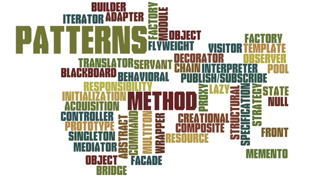

## Graphic Design

  When I was in highschool, I took a Graphic Design class. Graphic Design uses the creation and combination of symbols, images and text to convey messages. When I took the class, I learned different techniques and design patterns to create posters, t-shirts, etc. These patterns were simple and reusable in different types of projects that we did. One design pattern that I re-used a lot is the use of color contrast to make text readable and visually appealing. Another design pattern placing a logo on the corner instead of the center. This design can be seen on shirts a lot. Our class emphasized sleek and simple designs, however there are exceptions to these if we find something that looks more appealing. Some of these design patterns can be used software design, most especially in user interfaces such as CSS and HTML, after all they are called GUI's. 
 
## Graphic Design vs. Software Design
  
  So what does Graphic Design have to do with Software Design? Well Graphics and Software Design may not have many similarities but they do use design patterns a lot. Design patterns are generally reusable solutions to solve common re-occurring problems. In Graphic Design, I used the simple design pattern of color contrast to solve the problem of visibility of text on my illustrations. This same design pattern can be applied when developing software as well. When I create a webpage, I always adjusted the background color to be brighter or darker depending on the color of my buttons, text, etc. on my webpage. Another graphic design pattern I use on my webpages is putting illustrations on the corners. I usually put a logo or the name of the website on the top left corner of the page, so there out of the way but not thoroughly gone so people know what the website is. A lot websites use this design pattern also like google and GitHub where they have their title or logo on the top left while browsing through web pages. 
   
##  Design Patterns in Coding 

  Design patterns from Graphic Design can improve my software but what are some Software Design patterns can I use to improve it some more? Well one common and effective one is Model-View-Controller (MVC for short). This design pattern separates your code into three different parts, the model which is the database the holds data such as a collection of images, the view which is how the data is being presented to the user, and the controller which is how the user can interact with the software and manipulate the data. This design patterns allow the coder to be able to reuse code effectively and allow parallel development. In developing my website, this allows me to focus on a specific aspect of my code without getting lost in the endless void of code. So Overall, design patterns are effective in pointing you in the right direction but it is important to note that it is how you use them that determines the outcome.

