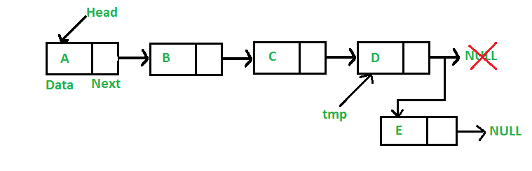

List Project is a linked list program that takes a set of records and makes a linked list out of it. In the program we can add, delete, modify, sort, and reverse the list. This project was done solo.

The project was done on C/C++ and it was a cumulative of all the things that we learned about C and C++ in ICS 212. We also had learn how to use Unix as well as how to make Makefiles and SCCS. This was one of the hardest projects I have done in my entire school career but I learned many skills from it like time management and debugging. I also learned how to write Pseudocode effectively doing this project.
 
Source: <a href="https://github.com/cristianaspacio/linked_list"><i class="large github icon"></i>LinkedList</a>
